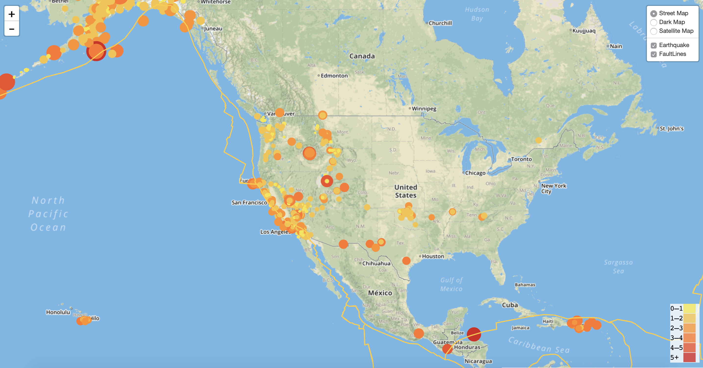
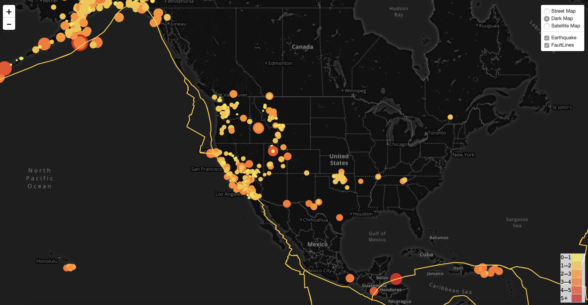
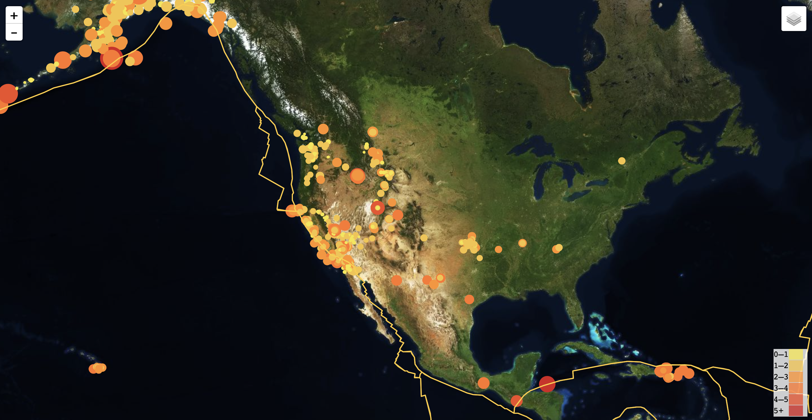

# GeoMapping with Leaflet

## Overview:
Assignment in which USGS earthquake data was mapped alongside tectonic plate data using JavaScript, HTML and Leaflet.

## Data:

The data used was 'all earthquakes from the Past 7 Days' extracted in JSON format from the United States Geological Survey, or USGS. The URL of this JSON and an API key were used to pull in the data. The tectonic plate and seismic activity data was pulled from https://github.com/fraxen/tectonicplates. 

## Workflow:

html and Javascript  and leaflet visualize an earthquake data set. , you will be given a JSON representation of that data. You will be using the U

A map was created using Leaflet, plotting all of the earthquakes from your data set based on their longitude and latitude. The tectonic plates were visualized alongside the seismic activity data. The magnitude of the earthquake was represented by the size and color. Earthquakes with higher magnitudes should are larger and darker in color.

Three base maps were chosen to visualize the street, satellite, and dark views. The two  datasets were separated into overlays that can be turned on and off independently.

## Maps:

- Street Map

- Dark Map

- Satellite Map

